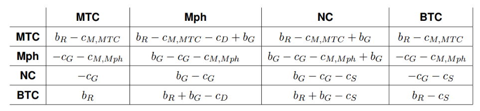

# Simulador del crecimiento celular en el cancer de Máma

> El siguiente programa está sustentado en el trabajo de Ramon Diaz Uriarte y su simulador ["OncoSimulR"](https://academic.oup.com/bioinformatics/article-pdf/doi/10.1093/bioinformatics/btx077/25155544/btx077.pdf) y el modelo matematico presentado en ["Modeling of breast cancer through evolutionary game theory"](https://projecteuclid.org/journals/involve-a-journal-of-mathematics/volume-11/issue-4/Modeling-of-breast-cancer-through-evolutionary-game-theory/10.2140/involve.2018.11.541.full").

**Table of Contents**

## Formulación del Modelo
Es necesario aclarar que el modelo utilizado en este proyecto ya existe, lo que quiere decir que este apartado no se centrará en la formulación del mismo. Mas sin embargo es necesario estudiar su funcionamiento y algunas características que se presentan a continuación.
ONCOSIMULR es un modelo de simulación que está escrito en R, por ser el lenguaje predominante en el sector bioinformático, aunque también contiene código en C++ para conseguir mayor eficiencia en la ejecución del algoritmo BNB. El paquete pertenece a Bioconductor, un proyecto open source en el que están contenidos diversos paquetes escritos en R que proporcionan funcionalidades relacionadas con la bioinformática.
Una funcionalidad que posee OncoSimulR es la de permitir al usuario especificar el fitness de cada genotipo explícitamente. Las herramientas encargadas de esto son las siguientes: 
### Modelo Matemático enfocado a simulación
Un modelo matemático presentado por el Ingenierio Corbin Smith en su trabajo Modeling of breast through evolutionary game theory (2018, vol. 11, no.4). Este modelo matemático considera cuatro tipo de células:
- Las **Células nativas (NC)** que son las células saludables
- Los **Macrófagos (Mph)** que son parte del sistema inmunitario 
- Las **Células Tumorales Benignas (BTC)**, que son células que no tienen la habilidad de hace metástasis
- Las **Células Tumorales Mótiles (MTC)**, que son celulasa que pueden invadir tejidos vecinos

¿Cómo interactúan estos cuatro tipos de células entre sí? Tanto las células nativas como los macrófagos producen un factor de crecimiento, el cual beneficia a todos los tipos de células. Se asume que el coste de producir el factor de crecimiento (cG) y los beneficios del factor de crecimiento (bG) son los mismos para todos los tipos de células. Los macrófagos y las células tumorales motiles se pueden mover y se asume que dicha habilidad tiene los costes cM,Mph y cM,MTC, respectivamente. Las células nativas y las células tumorales benignas no se desplazan, por lo que tienen que compartir los recursos con otras células nativas y células tumorales benignas, con coste cS. Las células cancerosas se reproducen más rápidamente que las células nativas o macrófagos, por lo que añadimos un beneficio adicional bR a las células cancerosas. Sin embargo, las células cancerosas pueden ser destruidas por los macrófagos, por lo que tiene un coste cD para las células cancerosas.
Con estos datos podemos generar una tabla de beneficios:

